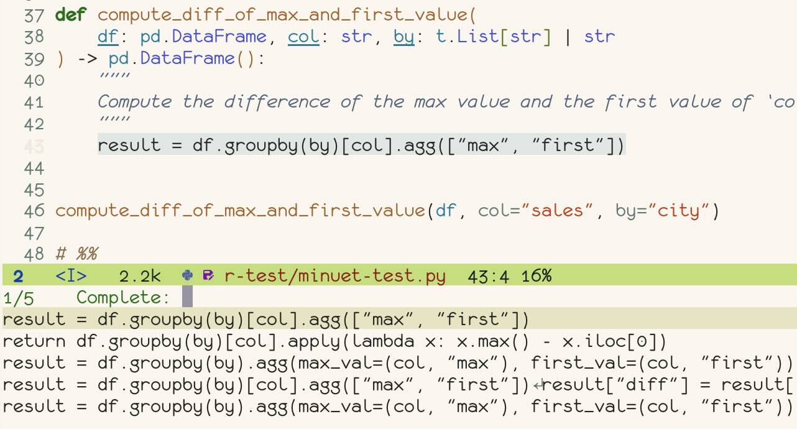
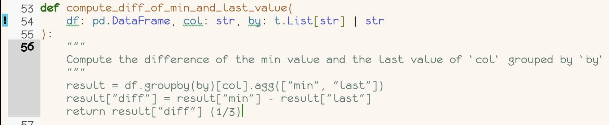

- [Minuet AI](#minuet-ai)
- [Features](#features)
- [Requirements](#requirements)
- [Installation](#installation)
- [API Keys](#api-keys)
- [Selecting a Provider or Model](#selecting-a-provider-or-model)
- [System Prompt](#system-prompt)
- [Configuration](#configuration)
  - [minuet-provider](#minuet-provider)
  - [minuet-context-window](#minuet-context-window)
  - [minuet-context-ratio](#minuet-context-ratio)
  - [minuet-request-timeout](#minuet-request-timeout)
  - [minuet-add-single-line-entry](#minuet-add-single-line-entry)
  - [minuet-n-completions](#minuet-n-completions)
- [Provider Options](#provider-options)
  - [OpenAI](#openai)
  - [Claude](#claude)
  - [Codestral](#codestral)
  - [Gemini](#gemini)
  - [OpenAI-compatible](#openai-compatible)
  - [OpenAI-FIM-Compatible](#openai-fim-compatible)

# Minuet AI

Minuet AI: Dance with Intelligence in Your Code 💃.

`Minuet-ai` brings the grace and harmony of a minuet to your coding process.
Just as dancers move during a minuet.

# Features

- AI-powered code completion with dual modes:
  - Specialized prompts and various enhancements for chat-based LLMs on code completion tasks.
  - Fill-in-the-middle (FIM) completion for compatible models (DeepSeek, Codestral, and others).
- Support for multiple AI providers (OpenAI, Claude, Gemini,
  Codestral, and OpenAI-compatible services)
- Customizable configuration options
- Streaming support to enable completion delivery even with slower LLMs

**With completion-in-region**:



**With overlay frontend**:



# Requirements

- emacs 29+
- plz 0.9+
- dash
- An API key for at least one of the supported AI providers

# Installation

Currently you need to install from github via `package-vc` or
`straight`, or manually install this package.

```elisp

;; install with straight
(straight-use-package '(minuet :host github :repo "milanglacier/minuet-ai.el"))

(use-package minuet
    :init
    (general-define-key
     ;; use completion-in-region for completion
     "M-y" #'minuet-completion-region
     ;; use overlay for completion
     "M-i" #'minuet-show-suggestion)

     ;; if you want to enable auto suggestion.
     ;; Note that you can manually invoke completions without enable minuet-auto-suggestion-mode
     (add-hook 'prog-mode-hook #'minuet-auto-suggestion-mode)

    :config
    (setq minuet-provider 'openai-fim-compatible)

    ;; Required when defining minuet-ative-mode-map in insert/normal states.
    ;; Not required when defining minuet-active-mode-map without evil state.
    (add-hook 'minuet-active-mode-hook #'evil-normalize-keymaps)

    (general-define-key
     :keymaps 'minuet-active-mode-map
     "M-p" #'minuet-previous-suggestion ;; invoke completion or cycle to next completion
     "M-n" #'minuet-next-suggestion ;; invoke completion or cycle to previous completion
     "M-A" #'minuet-accept-suggestion ;; accept whole completion
     "M-a" #'minuet-accept-suggestion-line ;; accept current line completion
     "M-e" #'minuet-dismiss-suggestion)

    (minuet-set-optional-options minuet-openai-fim-compatible-options :max_tokens 256))
```

Example for Ollama:

<details>

```elisp
(use-package minuet
    :config
    (setq minuet-provider 'openai-fim-compatible)
    (plist-put minuet-openai-fim-compatible-options :end-point "http://localhost:11434/v1/completions")
    ;; an arbitrary non-null environment variable as placeholder
    (plist-put minuet-openai-fim-compatible-options :name "Ollama")
    (plist-put minuet-openai-fim-compatible-options :api-key "TERM")
    (plist-put minuet-openai-fim-compatible-options :model "qwen2.5-coder:3b")

    (minuet-set-optional-options minuet-openai-fim-compatible-options :max_tokens 256))
```

</details>

Example for Fireworks with `llama-3.3-70b` model:

<details>

```elisp
(use-package minuet
    :config
    (setq minuet-provider 'openai-compatible)
    (plist-put minuet-openai-compatible-options :end-point "https://api.fireworks.ai/inference/v1/chat/completions")
    (plist-put minuet-openai-compatible-options :api-key "FIREWORKS_API_KEY")
    (plist-put minuet-openai-compatible-options :model "accounts/fireworks/models/llama-v3p3-70b-instruct")

    (minuet-set-optional-options minuet-openai-compatible-options :max_tokens 256)
    (minuet-set-optional-options minuet-openai-compatible-options :top_p 0.9))
```

</details>

# API Keys

Minuet AI requires API keys to function. Set the following environment variables:

- `OPENAI_API_KEY` for OpenAI
- `GEMINI_API_KEY` for Gemini
- `ANTHROPIC_API_KEY` for Claude
- `CODESTRAL_API_KEY` for Codestral
- Custom environment variable for OpenAI-compatible services (as specified in your configuration)

**Note:** Provide the name of the environment variable to Minuet
inside the provider options, not the actual value. For instance, pass
`OPENAI_API_KEY` to Minuet, not the value itself (e.g., `sk-xxxx`).

If using Ollama, you need to assign an arbitrary, non-null environment
variable as a placeholder for it to function.

```lisp
;; Good
(plist-put minuet-openai-compatible-options :api-key "FIREWORKS_API_KEY")
;; Bad
(plist-put minuet-openai-compatible-options :api-key "sk-xxxxx")
```

# Selecting a Provider or Model

The `gemini-flash` and `codestral` models offer high-quality output
with free and fast processing. For optimal quality, consider using the
`deepseek-chat` model, which is compatible with both
`openai-fim-compatible` and `openai-compatible` providers. For local
LLM inference, you can deploy either `qwen-coder` or `deepseek-coder`
through Ollama using the `openai-fim-compatible` provider.

# System Prompt

See [prompt](./prompt.md) for the default system prompt used by `minuet` and
instructions on customization.

Please note that the System Prompt only applies to chat-based LLMs (OpenAI,
OpenAI-Compatible, Claude, and Gemini). It does not apply to Codestral and
OpenAI-FIM-compatible models.

# Configuration

Below are commonly used configuration options. To view the complete
list of available settings, search for `minuet` through the
`customize` interface.

## minuet-provider

Set the provider you want to use for completion with minuet, available
options: `openai`, `openai-compatible`, `claude`, `gemini`,
`openai-fim-compatible`, and `codestral`.

The default is `openai-fim-compatible` using the deepseek endpoint.

You can use `ollama` with either `openai-compatible` or
`openai-fim-compatible` provider, depending on your model is a chat
model or code completion (FIM) model.

## minuet-context-window

The maximum total characters of the context before and after cursor.
This limits how much surrounding code is sent to the LLM for context.

The default is 12800, which roughly equates to 4000 tokens after
tokenization.

## minuet-context-ratio

Ratio of context before cursor vs after cursor. When the total
characters exceed the context window, this ratio determines how much
context to keep before vs after the cursor. A larger ratio means more
context before the cursor will be used. The ratio should between 0 and
`1`, and default is `0.75`.

## minuet-request-timeout

Maximum timeout in seconds for sending completion requests. In case of
the timeout, the incomplete completion items will be delivered. The
default is `3`.

## minuet-add-single-line-entry

For `minuet-completion-in-region` function, Whether to create
additional single-line completion items. When non-nil and a
completion item has multiple lines, create another completion item
containing only its first line. This option has no impact for
overlay-based suggesion.

## minuet-n-completions

Number of completion items to request from the language model. This
number is encoded as part of the prompt for the chat LLM. Note that
when `minuet-add-single-line-entry` is true, the actual number of
returned items may exceed this value. Additionally, the LLM cannot
guarantee the exact number of completion items specified, as this
parameter serves only as a prompt guideline. The default is `3`.

# Provider Options

You can customize the provider options using `plist-put`, for example:

```lisp
(with-eval-after-load 'minuet
    ;; change openai model to gpt-4o
    (plist-put minuet-openai-options :model "gpt-4o")

    ;; change openai-compatible provider to use fireworks
    (setq minuet-provider 'openai-compatible)
    (plist-put minuet-openai-compatible-options :end-point "https://api.fireworks.ai/inference/v1/chat/completions")
    (plist-put minuet-openai-compatible-options :api-key "FIREWORKS_API_KEY")
    (plist-put minuet-openai-compatible-options :model "accounts/fireworks/models/llama-v3p3-70b-instruct")
)
```

To pass optional paramters (like `max_tokens` and `top_p`) to send to
the REST request, you can use function
`minuet-set-optional-options`:

```lisp
(minuet-set-optional-options minuet-openai-options :max_tokens 256)
(minuet-set-optional-options minuet-openai-options :top_p 0.9)
```

## OpenAI

<details>

Below is the default value:

```lisp
(defvar minuet-openai-options
    `(:model "gpt-4o-mini"
      :system
      (:template minuet-default-system-template
       :prompt minuet-default-prompt
       :guidelines minuet-default-guidelines
       :n-completions-template minuet-default-n-completion-template)
      :fewshots minuet-default-fewshots
      :optional nil)
    "config options for Minuet OpenAI provider")

```

</details>

## Claude

<details>

Below is the default value:

```lisp
(defvar minuet-claude-options
    `(:model "claude-3-5-sonnet-20241022"
      :max_tokens 512
      :system
      (:template minuet-default-system-template
       :prompt minuet-default-prompt
       :guidelines minuet-default-guidelines
       :n-completions-template minuet-default-n-completion-template)
      :fewshots minuet-default-fewshots
      :optional nil)
    "config options for Minuet Claude provider")
```

</details>

## Codestral

<details>

Codestral is a text completion model, not a chat model, so the system prompt
and few shot examples does not apply. Note that you should use the
`CODESTRAL_API_KEY`, not the `MISTRAL_API_KEY`, as they are using different
endpoint. To use the Mistral endpoint, simply modify the `end_point` and
`api_key` parameters in the configuration.

Below is the default value:

```lisp
(defvar minuet-codestral-options
    '(:model "codestral-latest"
      :end-point "https://codestral.mistral.ai/v1/fim/completions"
      :api-key "CODESTRAL_API_KEY"
      :optional nil)
    "config options for Minuet Codestral provider")
```

The following configuration is not the default, but recommended to prevent
request timeout from outputing too many tokens.

```lisp
(minuet-set-optional-options minuet-codestral-options :stop ["\n\n"])
(minuet-set-optional-options minuet-codestral-options :max_tokens 256)
```

</details>

## Gemini

You should use the end point from Google AI Studio instead of Google
Cloud. You can get an API key via their [Google API
page](https://makersuite.google.com/app/apikey).

<details>

The following config is the default.

```lisp
(defvar minuet-gemini-options
    `(:model "gemini-1.5-flash-latest"
      :system
      (:template minuet-default-system-template
       :prompt minuet-default-prompt
       :guidelines minuet-default-guidelines
       :n-completions-template minuet-default-n-completion-template)
      :fewshots minuet-default-fewshots
      :optional nil)
    "config options for Minuet Gemini provider")
```

The following configuration is not the default, but recommended to prevent
request timeout from outputing too many tokens. You can also adjust the safety
settings following the example:

```lisp
(minuet-set-optional-options minuet-gemini-options
                             :generationConfig
                             '(:maxOutputTokens 256
                               :topP 0.9))
(minuet-set-optional-options minuet-gemini-options
                             :safetySettings
                             [(:category "HARM_CATEGORY_DANGEROUS_CONTENT"
                               :threshold "BLOCK_NONE")
                              (:category "HARM_CATEGORY_HATE_SPEECH"
                               :threshold "BLOCK_NONE")
                              (:category "HARM_CATEGORY_HARASSMENT"
                               :threshold "BLOCK_NONE")
                              (:category "HARM_CATEGORY_SEXUALLY_EXPLICIT"
                               :threshold "BLOCK_NONE")])
```

</details>

## OpenAI-compatible

Use any providers compatible with OpenAI's chat completion API.

For example, you can set the `end_point` to
`http://localhost:11434/v1/chat/completions` to use `ollama`.

<details>

The following config is the default.

```lisp
(defvar minuet-openai-compatible-options
    `(:end-point "https://api.groq.com/openai/v1/chat/completions"
      :api-key "GROQ_API_KEY"
      :model "llama-3.3-70b-versatile"
      :system
      (:template minuet-default-system-template
       :prompt minuet-default-prompt
       :guidelines minuet-default-guidelines
       :n-completions-template minuet-default-n-completion-template)
      :fewshots minuet-default-fewshots
      :optional nil)
    "Config options for Minuet OpenAI compatible provider.")
```

The following configuration is not the default, but recommended to prevent
request timeout from outputing too many tokens.

```lisp
(minuet-set-optional-options minuet-openai-compatible-options :max_tokens 256)
(minuet-set-optional-options minuet-openai-compatible-options :top_p 0.9)
```

</details>

## OpenAI-FIM-Compatible

Use any provider compatible with OpenAI's completion API. This request uses the
text completion API, not chat completion, so system prompts and few-shot
examples are not applicable.

For example, you can set the `end_point` to
`http://localhost:11434/v1/completions` to use `ollama`.

<details>

The following config is the default.

```lisp
(defvar minuet-openai-fim-compatible-options
    '(:model "deepseek-chat"
      :end-point "https://api.deepseek.com/beta/completions"
      :api-key "DEEPSEEK_API_KEY"
      :name "Deepseek"
      :optional nil)
    "config options for Minuet OpenAI FIM compatible provider")
```

The following configuration is not the default, but recommended to prevent
request timeout from outputing too many tokens.

```lisp
(minuet-set-optional-options minuet-openai-fim-compatible-options :max_tokens 256)
(minuet-set-optional-options minuet-openai-fim-compatible-options :top_p 0.9)
```

</details>
